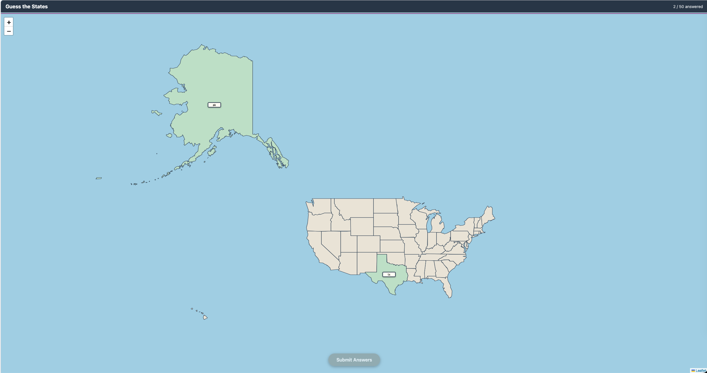

# The 50 States Game

Here's a little memory jogger game that will help you identify all 50 states. 

## How to play:

1. Click on a state.
2. Enter the state name or abbreviation in the input field.
3. Once you have all 50 states filled in, click the **Submit** button.

